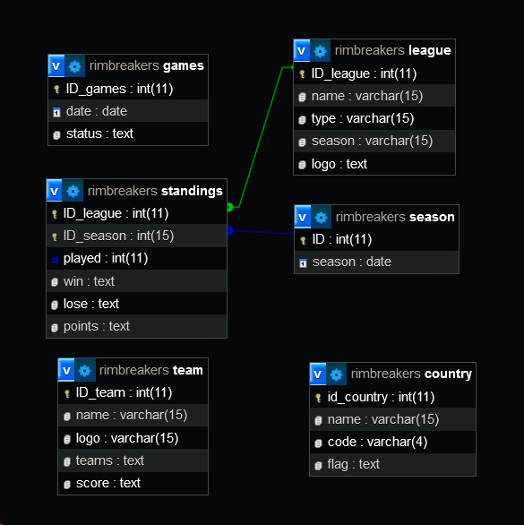
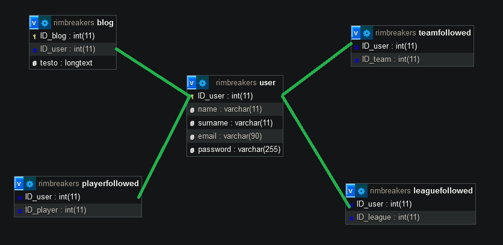

# Documentazione

## Script acquisizione delle api

per ricreare il database abbiamo usato uno script che è progettato per ottenere i dati delle partite di basket da un'API. Prima di tutto, legge una data di checkpoint da un file e inizia a interrogare l'API per ogni giorno del mese corrente. Dopo ogni 10 chiamate API, il programma fa una pausa di 60 secondi per evitare di superare il limite di chiamate consentite. Inoltre, tiene traccia del numero massimo di chiamate API consentite e salva il checkpoint della data in un file, in modo da poter riprendere l'interrogazione da dove si era interrotta in caso di superamento del limite di chiamate API. Una volta completato un mese, il programma passa al mese successivo fino a quando non ha completato l'intero anno.

## Pulizia

dagli script e stato creato un file con l'obiettivo di acquisire dati sportivi da file JSON, elaborarli e successivamente inserirli in un database MySQL locale. L'idea di base è fornire una soluzione pratica per l'aggiornamento di risultati e statistiche sportive su un portale web dedicato.

## Creazione DB

usando i precedenti file json (games and standings) abbiamo creato il seguente database:

poi ci servira una parte di utentistica

## Java docs

## Documentazione api

